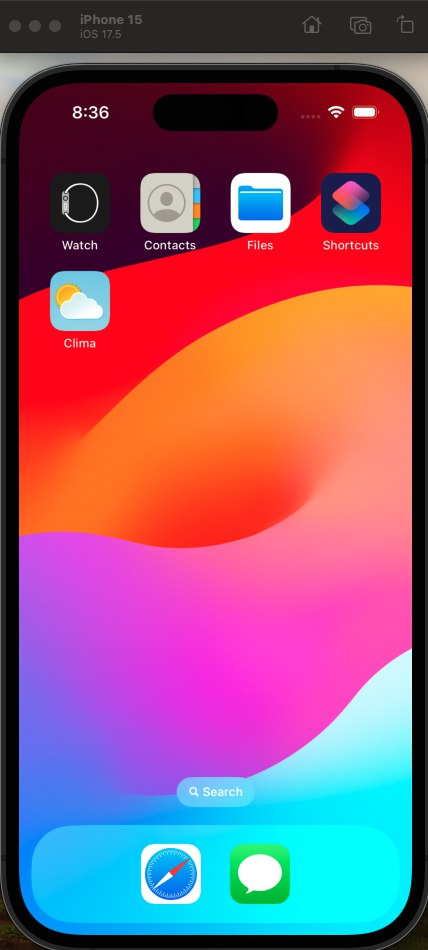
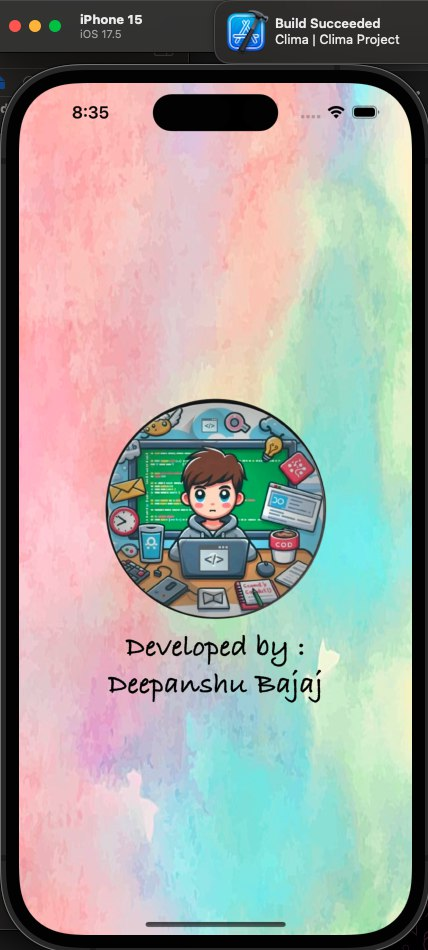
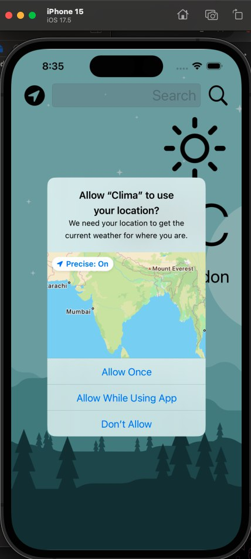
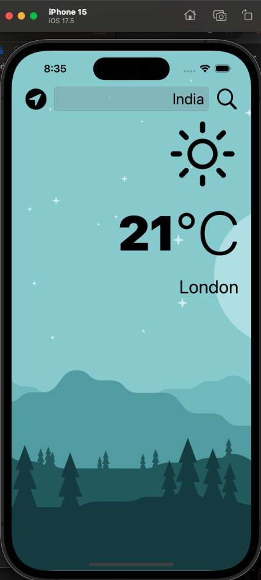
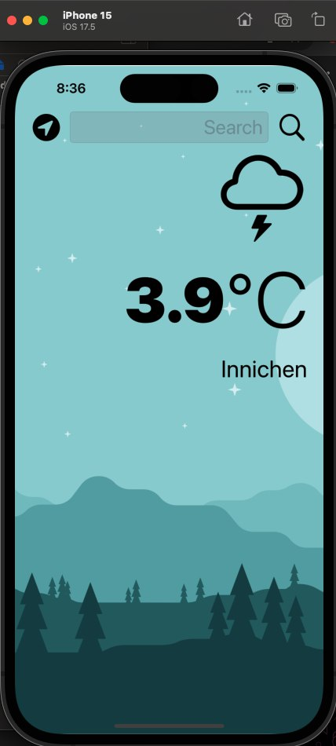
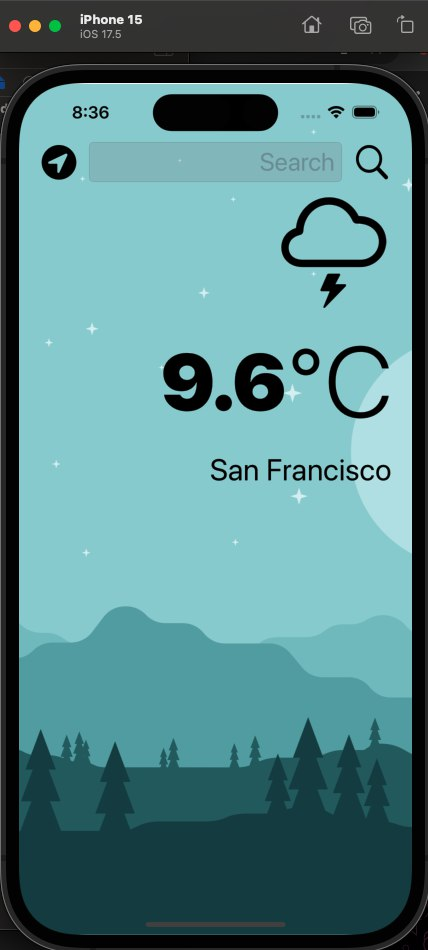
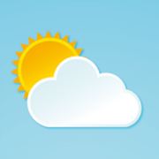
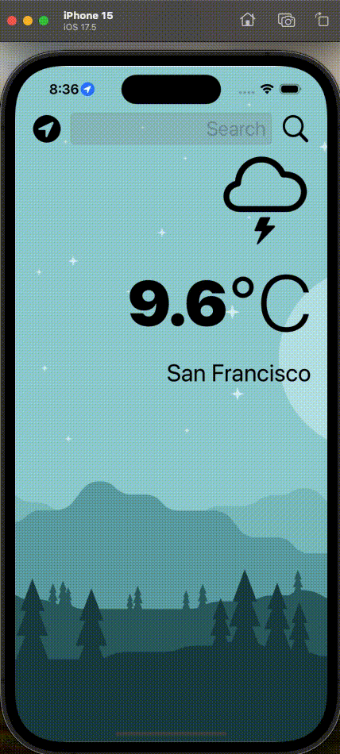

<h1 align="center">Clima - iOS App</h1>

**Clima** is a beautiful, dark-mode enabled weather app that provides real-time weather information. Using the latest weather data from a weather API, you can easily check the weather of your current location based on GPS data or manually search for any city. Stay updated with accurate weather details right at your fingertips.

## Features:

- **Current Location Weather**: Get weather details for your current location using GPS data from your iPhone.
- **Manual City Search**: Search for weather information of any city worldwide.
- **Real-Time Weather Data**: Fetch weather details from a reliable weather API to give you accurate updates.
- **Dark Mode Support**: Enjoy a sleek and modern design with dark mode support.
- **User-Friendly Interface**: A clean and simple interface that makes it easy to check the weather.

## Installation:

To run this project locally:

1. Clone the repository:
    ```bash
    git clone https://github.com/deepanshubajaj/Clima-iOSApp.git
    ```

2. Open the project in Xcode:
    ```bash
    open Clima.xcodeproj
    ```

3. Build and run the app on a simulator or physical device.

> Make sure you have Xcode installed and configured properly to run the project.

## API Reference:

- **OpenWeather API**: The weather data for this app is fetched from the [OpenWeather API](https://openweathermap.org/api). You can find their documentation for more details on how to use it and access various weather data endpoints.
- **API Key Setup**: To use the OpenWeather API, you'll need an API key. You can obtain one from [here](https://openweathermap.org/appid).
- **Current Weather Data**: You can explore the documentation for retrieving current weather data from OpenWeather [here](https://openweathermap.org/current).
- **Project Usage**: Add your own API-Id Value by adding the file envFileClimaApp.swift in the project in the following format.
    ```bash
    // envFileClimaApp.swift

    import Foundation

    struct envFileClimaApp {
        static let apiIdValue = "Your_Own_API_Value"
    }
    ```

## App Look:

<p align="center">
  
</p>
<p align="center">
  *App snapshot in the simulator.*
</p>

## Screenshots:

<p align="center">
  
</p>
<p align="center">
  *Splash screen displayed upon app launch.*
</p>

<p align="center">
  <div style="display: flex; justify-content: center; gap: 10px;">
    
    
    
  </div>
</p>

<p align="center">
  <div style="display: flex; justify-content: center; gap: 10px;">
    
    
    
  </div>
</p>

<p align="center">
  *Screenshots of the Clima app showing different stages of the weather forecast process.*
</p>

## App Icon:

<p align="center">
  
</p>
<p align="center">
  *The app icon reflects the clean, modern, and weather-focused theme of the Clima app.*
</p>

## Video Demo:

Here’s a short video showcasing the app's functionality:

<p align="center">
  
</p>

[Watch Working Video](ProjectOutputs/WorkingVideo/workingVideo.mov)
